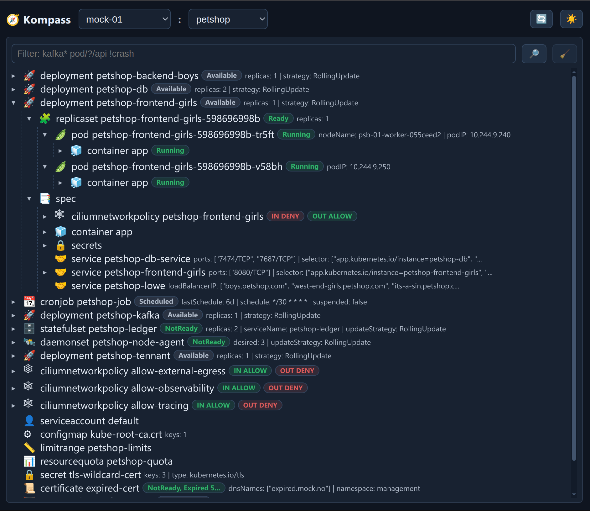

# 🧭 Kompass


[](https://pkg.go.dev/github.com/karloie/kompass)
[](https://opensource.org/licenses/MIT)
[](go.mod)
[%22&replace=%24%3Cversion%3E&label=homebrew)](https://github.com/karloie/homebrew-tap)
[](https://hub.docker.com/r/karloie/kompass)

Kompass is a Kubernetes explorer for understanding resource relationships in real clusters. Query with patterns and browse connected topology, logs, YAML, certs, and diagnostics from one UI.

## Features

- **Wildcard selectors** - Patterns like `*/namespace/*`, `deployment/*/frontend`
- **30+ Kubernetes resources** - Workloads, networking, storage, RBAC, cert-manager, Cilium
- **Web UI + JSON APIs** - Topology exploration and machine-friendly integration
- **Dependency-aware ordering** - Controllers and related resources are grouped for readable topology
- **Go library** - Use in your tools
- **HTTP API** - Programmatic access
- **Mock data** - Test without cluster

## Supported Resources

- **Workloads**: Pod, Deployment, ReplicaSet, StatefulSet, DaemonSet, Job, CronJob  
- **Networking**: Service, Endpoints, EndpointSlice, Ingress, NetworkPolicy, Gateway, HTTPRoute, CiliumNetworkPolicy  
- **Storage**: PersistentVolume, PersistentVolumeClaim, StorageClass, VolumeAttachment, CSIDriver, CSINode  
- **Config**: ConfigMap, Secret, ServiceAccount  
- **RBAC**: Role, RoleBinding, ClusterRole, ClusterRoleBinding  
- **Cert**: Certificate, Issuer, ClusterIssuer  
- **Other**: HorizontalPodAutoscaler, Node

## Web Quick Start

Kompass provides an interactive web UI and API for exploring topology, workloads, traffic paths, logs, YAML, certificates, and related Kubernetes metadata in one place.



Quick start (in cluster):

```bash
kubectl apply -f kubernetes.yaml
kubectl -n kompass rollout status deploy/kompass
kubectl -n kompass port-forward svc/kompass 8080:8080
```

Then open:

- `http://localhost:8080/` (web app)
- `http://localhost:8080/api/healthz` (liveness)

Quick start manifest default: `KOMPASS_AUTH_MODE=basic` with `admin/admin`.

**Security note:** This default is for local/quick demos only. Change credentials before shared use.

For shared/in-cluster deployments:

- For production/shared use, switch to `KOMPASS_AUTH_MODE=oidc` (preferred)
- For OIDC, set `KOMPASS_OIDC_ISSUER_URL`, `KOMPASS_OIDC_CLIENT_ID`, `KOMPASS_OIDC_CLIENT_SECRET`, `KOMPASS_OIDC_REDIRECT_URI`
- For Basic, set `KOMPASS_BASIC_AUTH_USER`, `KOMPASS_BASIC_AUTH_HASH` (bcrypt)
- Set `KOMPASS_REQUIRE_SECURE_CONNECTION=true` outside local dev

## CLI Quick Start

> **Prerequisite:** For CLI usage against a real cluster, you need a valid Kubernetes client configuration (kubeconfig) for your target context. `kubectl` is the most common way to set this up, but any valid kubeconfig source works.

```bash
# List all pods in current namespace
kompass
```

### Example Output

```
🌍 Kompass Context: mock-cluster, Namespace: petshop, Selectors: [*/petshop/petshop-frontend-girls], Config: mock, Cache: 32 calls | 0 hits | 32 misses | 0.0% hit rate

🚀 deployment petshop-frontend-girls [AVAILABLE] {available=1, current=1, namespace=petshop, ready=1, replicas=1, strategy=RollingUpdate, updated=1}
├─ 🧩 replicaset petshop-frontend-girls-598696998b [READY] {available=1, current=1, ready=1, replicas=1}
│  └─ 🫛 pod petshop-frontend-girls-598696998b-tr5ft [RUNNING] {podIP=10.244.9.240}
│     └─ 🧊 container app [RUNNING]
│        └─ 🐋 image petshop/petshop-frontend-girls:tr-6.0.6
├─ 🤝 service petshop-frontend-girls {ports=[8080/TCP], type=ClusterIP}
└─ 📑 spec
   └─ 🧊 container app
      ├─ ♻️ environment
      │  └─ 💬 NEO4J_URI=bolt://petshop-db-service:7687
      ├─ 🐋 image petshop/petshop-frontend-girls:tr-6.0.6
      └─ 🔧 resources {limits=memory:512Mi, requests=cpu:100m memory:128Mi}
```

Output shown is truncated for readability.

### Basic Commands

```bash
# Exact resource
kompass --mock deployment/petshop/petshop-kafka

# Multiple resources
kompass --mock */petshop/* */kafka-system/*

# Wildcard patterns
kompass '*/myapp/*'              # All resources in myapp namespace
kompass 'pod/*/*-api'            # All pods ending with -api
kompass 'deployment/prod/*'      # All deployments in prod namespace
```

### Resource Selector Format

- `name` - Resource in default namespace
- `namespace/name` - Resource in namespace
- `type/namespace/name` - Exact resource
- `*/namespace/*` - All in namespace

### CLI Options

| Flag | Short | Description |
|------|-------|-------------|
| `--context <name>` | `-c` | Kubernetes context |
| `--namespace <name>` | `-n` | Namespace |
| `--mock` | | Use mock data |
| `--debug` | `-d` | Enable debug logging |
| `--service [addr]` | | Start API server (`localhost:8080`) |
| `--version` | `-v` | Show version |
| `--help` | `-h` | Show help |

## Installation

### Go Install

```bash
go install github.com/karloie/kompass/cmd/kompass@latest
```

### Homebrew (macOS/Linux)

```bash
brew install karloie/tap/kompass
```

### Binary Download

Download pre-built binaries from [GitHub Releases](https://github.com/karloie/kompass/releases)

### Package Managers

```bash
# Debian/Ubuntu
wget https://github.com/karloie/kompass/releases/latest/download/kompass_<version>_linux_amd64.deb
sudo dpkg -i kompass_<version>_linux_amd64.deb

# Red Hat/Fedora/CentOS
wget https://github.com/karloie/kompass/releases/latest/download/kompass_<version>_linux_amd64.rpm
sudo rpm -i kompass_<version>_linux_amd64.rpm
```

## Server Usage

### Starting the Server

```bash
# Start server (default: localhost:8080)
kompass --service

# Custom port
kompass --service localhost:9090

# Bind to specific interface
kompass --service 0.0.0.0:8080

# With specific namespace and context
kompass --service --namespace production --context prod

# Using mock data
kompass --service --mock

# Enable debug logging
kompass --debug '*/petshop/*'
```

### API Endpoints

| Endpoint | Output | Usage |
|----------|--------|-------|
| `/api/graph` | Graph JSON (`nodes`, `edges`, `components`) | Default JSON endpoint for topology graphing. Use `selector` and `namespace`. |
| `/api/tree` | Tree JSON (`trees` + shared `nodes`) | Send `Accept: application/json`. Use `selector` and `namespace`. |
| `/api/metadata` | Cache/request metadata JSON | Inspect cache status and request metadata. |
| `/api/healthz` | Liveness probe (`ok`) | Basic health endpoint for uptime checks. |
| `/api/readyz` | Readiness probe (`ok` when ready) | Readiness endpoint used by probes/orchestration. |

Endpoints accept query parameters:

| Parameter | Description |
|-----------|-------------|
| `selector` | Resource selector (comma-separated, optional) |
| `namespace` | Target namespace |

Graph and tree JSON responses include request metadata under `request.selectors` as an array.

### API Examples

```bash
# JSON graph
curl -u admin:admin "http://localhost:8080/api/graph?selector=deployment/myapp/frontend&namespace=default"

# JSON tree
curl -u admin:admin -H "Accept: application/json" "http://localhost:8080/api/tree?namespace=production&selector=pod/production/myapp"

# Cache metadata
curl -u admin:admin "http://localhost:8080/api/metadata"

# Health check
curl -u admin:admin "http://localhost:8080/api/healthz"  # Liveness
curl -u admin:admin "http://localhost:8080/api/readyz"   # Readiness
```

### API Authentication

Auth mode is controlled by `KOMPASS_AUTH_MODE`:

- `none` (default): no auth, safe for local default bind (`localhost:8080`)
- `oidc`: OIDC login/session auth
- `basic`: HTTP Basic Auth with bcrypt password hash

`kubernetes.yaml` quick start defaults to `basic` with `admin/admin`.

OIDC (`KOMPASS_AUTH_MODE=oidc`) requires:

- `KOMPASS_OIDC_ISSUER_URL`
- `KOMPASS_OIDC_CLIENT_ID`
- `KOMPASS_OIDC_CLIENT_SECRET`
- `KOMPASS_OIDC_REDIRECT_URI`

Basic (`KOMPASS_AUTH_MODE=basic`) requires:

- `KOMPASS_BASIC_AUTH_USER`
- `KOMPASS_BASIC_AUTH_HASH`

`KOMPASS_BASIC_AUTH_HASH` must be a bcrypt hash (`$2a$...` style); salt is embedded in the hash.

For shared/in-cluster deployments, use `oidc` (preferred) or `basic`, and set `KOMPASS_REQUIRE_SECURE_CONNECTION=true`.

### Cilium / Hubble

Kompass uses the Hubble relay gRPC API for network flow data. The relay address is controlled by `KOMPASS_HUBBLE_ADDR`:

- **Local**: leave unset and run `kubectl port-forward -n kube-system svc/hubble-relay 4245:80`. Default is `127.0.0.1:4245`.
- **In-cluster**: set `KOMPASS_HUBBLE_ADDR=hubble-relay.kube-system.svc.cluster.local:80` (included in `kubernetes.yaml`).

If Hubble is unavailable, the Cilium tab shows a unavailable message and falls back to the `hubble` CLI if present in the container image.

## Development

### Building

```bash
make build
```

### Service Modes

```bash
# Dev mode (hot reload)
make dev

# Standard build
make build

# Release build
make build-release
```

Runtime behavior:

- `kompass --service` serves API endpoints on `localhost:8080` by default.
- Use `kompass --service 0.0.0.0:8080` to publish on all interfaces.

Snapshot behavior:

- `make snapshot` writes deterministic mock fixtures (`testdata/fixtures/mock.json`, `testdata/fixtures/mock.txt`).
- `make snapshot-real` writes real-cluster fixtures (`testdata/fixtures/real.json`, `testdata/fixtures/real.txt`).

### Running Tests

```bash
make test
```

### Coverage Report

```bash
make coverage
```

### Running Locally

```bash
# With mock data
make mock

# Against real cluster
make real
```

## License

MIT - see [LICENSE](LICENSE)
